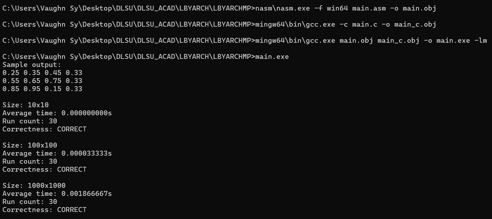

# LBYARCH S19A MP2 x86 to C Interface

## Group 10

- Sy, Vaughn Marick
- Tengco, Martin

## Specifications

Implement a function in x86-64 assembly that converts a grayscale image stored as 8-bit unsigned integers into a double-precision floating point representation by applying $f = \frac{i}{255}$.

## Instructions

### 0. Clone

- Clone into any root folder
- git clone https://github.com/lonebono/LBYARCHMP.git

### 1. NASM

- Download the latest ver: https://www.nasm.us/pub/nasm/releasebuilds/
- Create a `nasm` in the project root and extract `nasm.exe` there

### 2. MinGW-w64

- Download the latest ver: https://winlibs.com/#download-release
- Create a `mingw64` in the project root and extract it to that folder there

### 3. Run

- Copy and paste these commands line by line in CMD
- nasm\nasm.exe -f win64 main.asm -o main.obj
- mingw64\bin\gcc.exe -c main.c -o main_c.obj
- mingw64\bin\gcc.exe main.obj main_c.obj -o main.exe -lm
- main.exe

### Results

